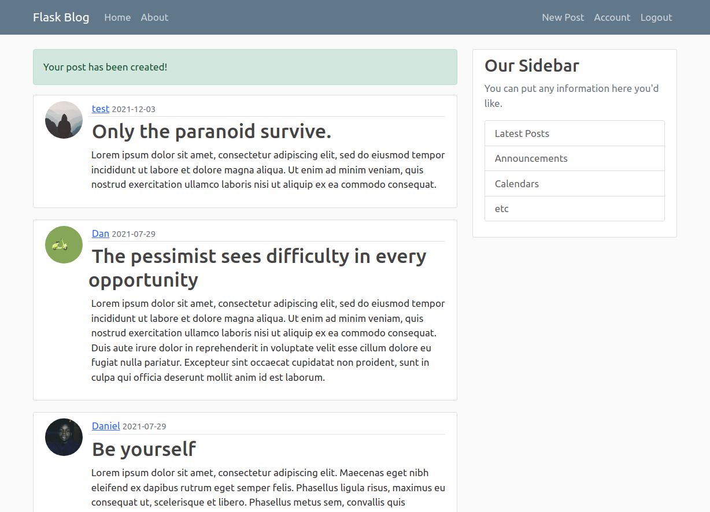
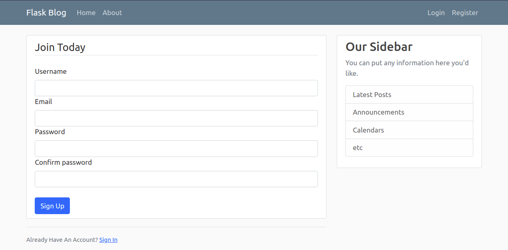
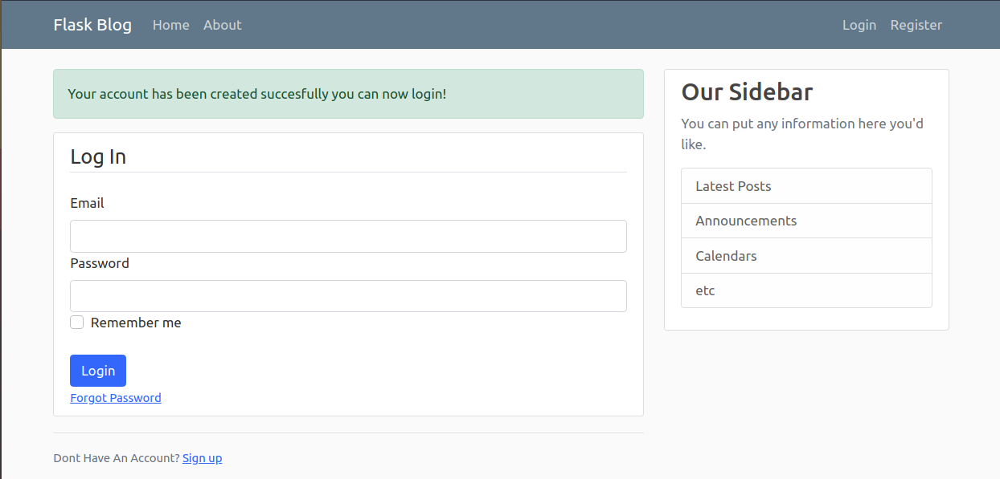
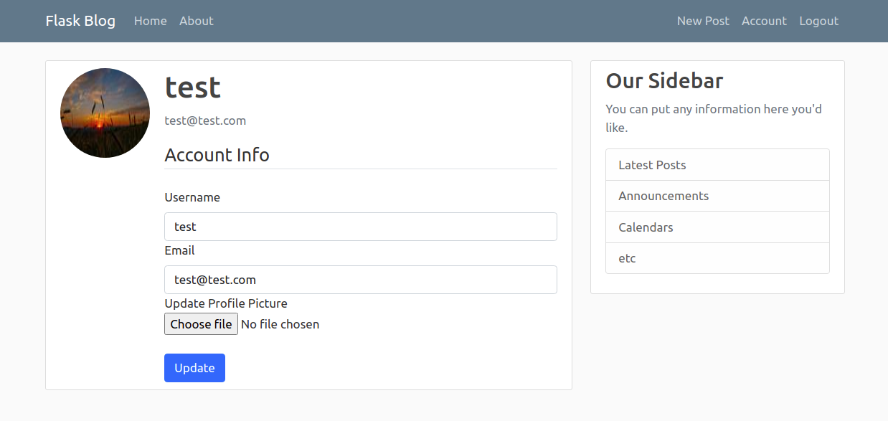
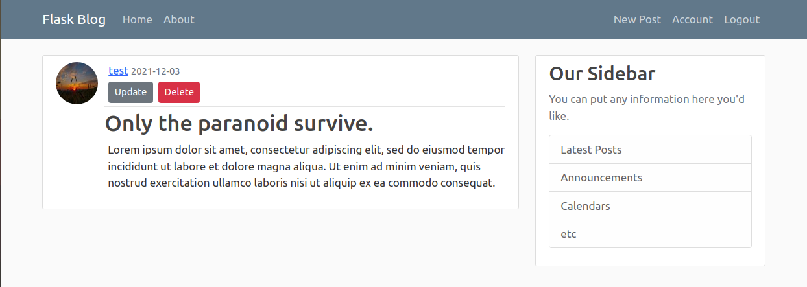
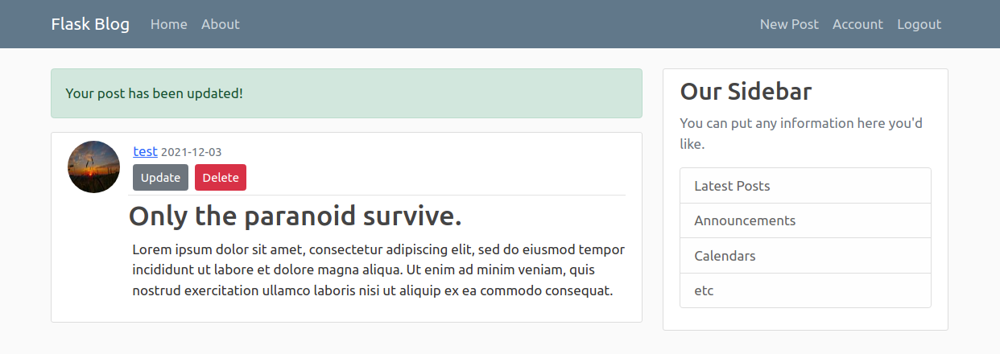

# Flaskblog

Flask blog  is a simple blog using Flask and Python.This is a learning project which follows the tutorial of [Corey Schafer][corey] on Youtube.

# Features!
  - Blogspot website with multiple users
  - Create, update and delete posts
  - Unique id for each post and user
  - Users can change their profile picture
  - Filtered pages for each user and their posts
  - Sengrid email api for password reset
  - Structred with flask blueprint

### Usage
Install dependencies
```bash
pip install -r requirements.txt
```
Run the wsgi server and app
```bash
python run.py
```
# Gallery
</img>
</img>
</img>
</img>
</img>
</img>

### Todo
 - User account deletion.
 - Tests
 - Database migration

   [corey]: <https://www.youtube.com/channel/UCCezIgC97PvUuR4_gbFUs5g>
